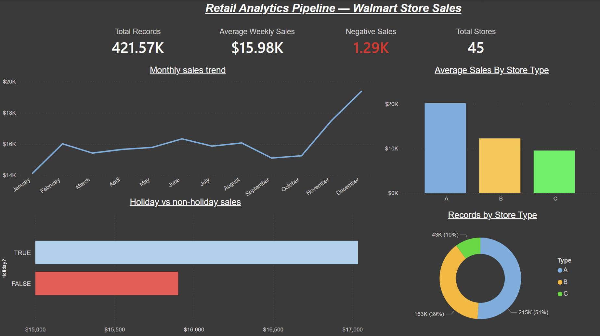
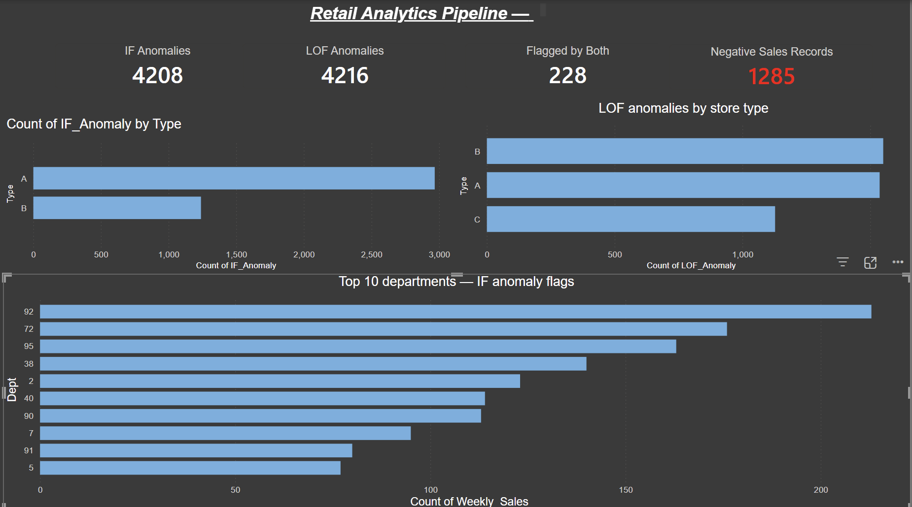

# Power BI Dashboard

## File

- **walmart_anomaly_dashboard.pbix** — Open this file in Power BI Desktop.

## Data Source

The dashboard uses `walmart_anomaly_results.csv` exported from the primary Walmart pipeline notebook. To refresh the data, update the CSV file path in Power Query.

## Dashboard Pages

### Page 1: Overview

This page gives a high-level summary of the Walmart retail dataset before anomaly detection.

- **Total Records** — 421,570 sales records across all stores and departments
- **Average Weekly Sales** — $15,981 across all store types
- **Negative Sales** — 1,285 records with negative values (returns/refunds/errors)
- **Total Stores** — 45 stores across 3 types (A, B, C)
- **Monthly Sales Trend** — Line chart showing seasonal peaks in November–December each year
- **Average Sales by Store Type** — Type A stores lead at $17,851, followed by B ($12,165) and C ($10,155)
- **Holiday vs Non-Holiday Sales** — Holiday periods average $17,013 vs $15,832 for non-holiday
- **Records by Store Type** — Donut chart showing Type A has 51% of records, Type B 39%, Type C 10%

### Page 2: Anomaly Detection

This page shows the results of both machine learning models and how they differ.

- **IF Anomalies** — 4,208 records flagged by Isolation Forest (1.0%)
- **LOF Anomalies** — 4,216 records flagged by Local Outlier Factor (1.0%)
- **Flagged by Both** — Only 228 records flagged by both models (2.8% overlap)
- **Negative Sales Records** — 1,285 known negative sales used as proxy ground truth
- **IF Anomalies by Store Type** — Type A dominates with ~2,900 flags due to higher sales volumes
- **LOF Anomalies by Store Type** — Type B leads, showing mid-sized stores have more local density deviations
- **Top 10 Departments (IF)** — Department 92 leads with 213 flags, followed by Dept 72 and Dept 95

## How to Open

1. Install Power BI Desktop (free from Microsoft)
2. Open `walmart_anomaly_dashboard.pbix`
3. If prompted about data source, update the file path to point to your local `walmart_anomaly_results.csv`
